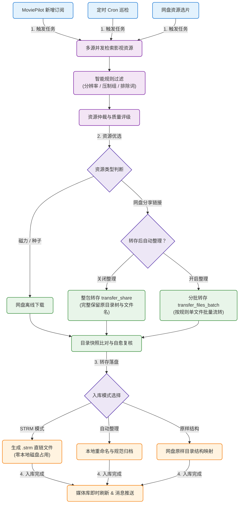

# 网盘订阅助手 (CloudSubscribe) 使用指南

网盘订阅助手是专为 MoviePilot 设计的多网盘全自动资源调度与媒体库整理插件，深度打通全网主流搜索源与各类云盘存储生态，同时原生兼容
**MoviePilot v2 与 v3**。

插件能自动接管电影、电视剧及动漫的订阅任务，通过多渠道并发检索最优网盘分享或磁力资源，全自动实现
**整包/多文件转存、磁力离线下载、规范化重命名整理或零硬盘占用的 STRM 直链秒级入库**
，并即时通知媒体服务器（Emby、Jellyfin、Plex、极影视、飞牛影视等）刷新海报与元数据。

---

## 一、 运转流程

---

## 二、 网盘配置

插件将网盘划分为 **可直接绑定的目标转存网盘（驱动层） **与**搜索渠道支持的网盘资源类型**。以下为 7 大直连目标网盘的特性与配置要求：

| 网盘类型     | 标识 Key  | 支持能力                          | 认证方式                | 配置要点与注意事项                                                    |
|:-------------|:----------|:----------------------------------|:------------------------|:----------------------------------------------------------------------|
| **115 网盘** | `115`     | 分享转存、磁力/电驴离线、目录浏览 | 网页扫码 / 填入 Cookie  | 支持离线下载与整包转存保留目录结构；Cookie 失效时需重新扫码或更新凭证 |
| **123 云盘** | `123`     | 分享转存、磁力离线、目录浏览      | App 扫码 / 填 Token     | 支持离线下载与整包转存保留目录结构；支持 App 扫码或直接填入访问令牌   |
| **夸克网盘** | `quark`   | 分享转存、目录浏览                | 网页扫码 / 客户端扫码   | 支持整包转存保留目录结构；需保持账号登录态有效                        |
| **阿里云盘** | `alipan`  | 分享转存、目录浏览                | 移动端扫码 / Open Token | 基于阿里云盘 Open API 授权；支持整包转存保留目录结构                  |
| **天翼云盘** | `tianyi`  | 分享转存、目录浏览                | 扫码登录 / 账号凭据     | 支持整包转存保留目录结构；需保持账号会话凭据有效                      |
| **移动云盘** | `yun139`  | 分享转存、目录浏览                | 扫码登录 / 认证凭据     | 支持整包转存保留目录结构；需保持账号会话凭据有效                      |
| **光鸭网盘** | `guangya` | 分享转存、目录浏览                | 账号密码 / Token 认证   | 支持整包转存保留目录结构；需配置账号密码或专用接口 Token              |

> **提示**：在每个网盘配置项的“转存路径”输入框右侧，点击图标即可唤起网盘目录树。支持直接在弹窗内选择目标目录、
> **新建文件夹**或 **一键刷新**。

---

## 三、 搜索渠道

插件内置了 12 个独立的搜索渠道，依据 **支持的网盘类型**和 **资源获取形态**细分为三大类：

### 1. 全网盘多源聚合渠道（覆盖主流云盘）

此类渠道能够同时检索多种主流网盘分享链接，资源覆盖面广：

| 渠道名称     | 标识 Key      | 支持的网盘与资源类型                                                   | 配置参数与说明                                                       |
|:-------------|:--------------|:-----------------------------------------------------------------------|:---------------------------------------------------------------------|
| **PanSou**   | `pansou`      | 115、123、夸克、阿里、天翼、移动、光鸭、磁力、电驴                     | 支持配置公共 API 地址或自建服务端地址与访问 Token                    |
| **SeedHub**  | `seedhub`     | 115、夸克、阿里、移动等                                                | 公开免密接口，无需配置凭证                                           |
| **在线文档** | `online_docs` | 115、123、夸克、阿里、百度、UC、天翼、移动、光鸭、迅雷、PikPak、磁力等 | 支持导入腾讯文档、金山文档等共享表格；可单独勾选各文档生效的网盘类型 |

### 2. 社区搜索渠道

| 渠道名称          | 标识 Key   | 支持的网盘与资源类型               | 配置参数与说明                                       |
|:------------------|:-----------|:-----------------------------------|:-----------------------------------------------------|
| **聚影**          | `juying`   | 115、123、夸克、阿里、天翼、移动等 | 支持配置网盘类型过滤列表与返回数量限制               |
| **盘链**          | `pinglian` | 115、123、夸克、阿里、天翼、移动等 | 需配置用户凭证，支持网盘类型过滤与返回数量限制       |
| **Dian115**       | `dian115`  | 115网盘分享、磁力                  | 专用于 115 网盘分享资源与磁力检索                    |
| **HDHive (影巢)** | `hdhive`   | 115、夸克、阿里、磁力              | 支持配置用户账号登录或 OAuth 授权接入                |
| **HDHaven**       | `hdhaven`  | 优质网盘分享                       | 需配置用户名与密码；支持在自动签到服务中配置定时打卡 |

### 3. 磁力下载渠道

当设置当前转存网盘为 115 或 123 时，此类渠道返回的磁力链接将自动提交至网盘离线下载队列：

| 渠道名称               | 标识 Key      | 产出资源类型                | 说明                         |
|:-----------------------|:--------------|:----------------------------|:-----------------------------|
| **海盗湾 (PirateBay)** | `piratebay`   | 磁力链接 (`magnet`)         | 海外影视与高码率原盘磁力检索 |
| **UIndex**             | `uindex`      | 磁力链接 (`magnet`)         | 综合高清影视磁力检索         |
| **AnimeGarden**        | `animegarden` | 磁力链接 (`magnet`)         | 动漫番组与字幕组版本磁力检索 |
| **Mikan**              | `mikan`       | 磁力链接 (`magnet`)、BT种子 | 新番动画与 BT 种子/磁力检索  |

---

## 四、 核心配置

### 1. 基础参数

- **启用插件**：总控开关。
- **启用左侧导航**：在 MoviePilot 左侧功能栏开启“网盘资源”大厅。
- **链接直达转存**：开启后，在 Telegram、微信或机器人聊天中发送网盘分享链接，插件自动解析并存入指定网盘路径。
- **写入整理历史**：转存落盘后向系统数据库写入历史记录，便于统一追踪与入库管理。
- **拦截新增订阅**：MoviePilot 产生新订阅时，由本插件优先接管在网盘渠道中检索，未命中时放行给系统本地下载器。
- **定时执行周期 (Cron)**：设置自动轮询巡检未完成订阅的周期，标准 5 段表达式，例如：`30 2,10,18 * * *`。
- **当前转存网盘**：从已成功绑定的网盘列表中选择当前执行转存的主力网盘。
- **启用媒体库**：勾选已配置的媒体服务器，转存完成后自动发起针对性刷新。

### 2. 转存入库

- **生成 STRM 模式（推荐）**：
    - 本地不下载实际视频大文件，仅生成记录网盘挂载直链的 `.strm` 文本索引文件；
    - 零磁盘占用，配合 AList / CloudDrive2 等网盘挂载工具，实现秒开播放。
- **转存后自动整理**：
    - 勾选后，调用 MoviePilot 整理引擎，按标准影视格式进行文件名重命名与归档。
- **关闭自动整理（原样结构保留）**：
    - 关闭整理开关时，插件直接执行整包分享转存机制（`transfer_share`），
      **完整保持分享者最初的多级文件夹树状结构与视频原名**，杜绝拆散母文件夹。

### 3. 风控参数

- **单批转存数量 (batch_size)**：默认 20 项，控制单次提交 API 的文件数量。
- **批次间隔 (batch_interval)**：默认 2 秒，降低高频连续请求，防止触发网盘接口流控。
- **风控熔断冷却时间 (transfer_risk_cooldown)**：默认 1800 秒，当网盘返回流控拦截时自动进入冷却保护。
- **转存目录快照复核机制**：转存前校验目标目录，已存在文件自动复用跳过；转存后核验快照，文件已落盘时自动自愈，杜绝虚假报错。

### 4. 自动签到

- 支持在“签到服务”中开启各网盘与支持渠道的每日定时打卡；
- 页面直观呈现近 7~14 天的打卡状态时间轴与累计打卡天数；
- 遇到漏签渠道可随时点击圆点手动发起补签，当日已成功的渠道不会重复提交。

---

## 五、 常见问题排查 (FAQ)

### Q1：网盘转存成功了，但 Emby / Jellyfin 没有显示影视海报？

1. **检查媒体库通知**：确认“通知设置”中勾选了正确的媒体服务器，且测试连通性正常；
2. **检查路径映射**：若使用 STRM 模式，确保媒体库扫描的文件夹路径与挂载工具（AList/CD2）映射的真实路径对应；
3. **确认命名合规**：部分小众冷门资源文件名过于杂乱导致刮削器无法识别，可使用自动整理模式进行规范重命名。

### Q2：STRM 播放提示直链失效或频繁缓冲？

1. **排查挂载源**：在 AList 等 Web 管理后台中直接点击该视频文件，测试网页端能否正常直链预览；
2. **检查网盘凭据**：网盘 Token 或 Cookie 过期会导致直链鉴权失败，需在网盘配置中重新登录认证；
3. **会员速率限制**：部分网盘对非会员限速，高码率原盘建议使用 VIP 账号。

### Q3：为什么部分搜索渠道提示 409 或 429？

- **409 Conflict**：多见于每日签到接口，提示“今日已完成签到”，系统已自动视作成功；
- **429 Too Many Requests**：说明向该渠道发起的搜索请求过于密集，可在配置中适当调大“批次间隔时间”（例如设置为 3~5 秒）。
